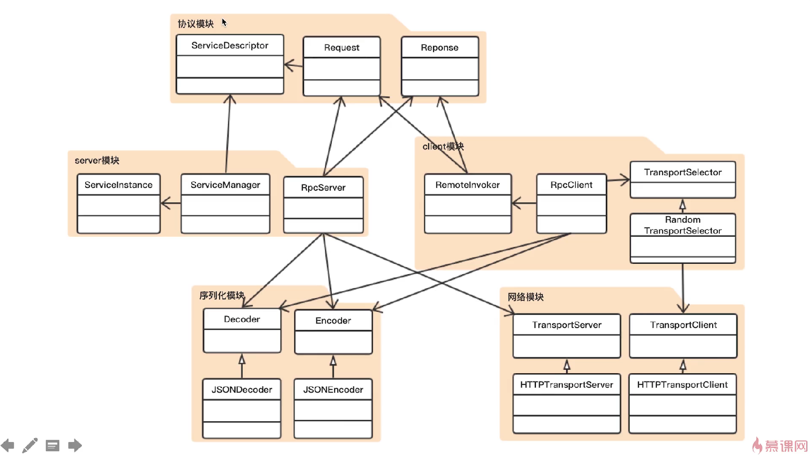

# wRPC
## RPC技术实现

1. 协议制定
2. 序列化模块
3. 服务传输模块
4. 服务端模块
5. 客户端模块

## 难点

### 难点1：Jetty嵌入

- Server
- ServletContextHandler
- ServletHolder

### 难点2: 动态代理

- Proxy.newProxyInstance
- RemoteInvoker implements InvocationHandler

## 不足与展望
- 安全性
- 服务端处理能力
- 注册中心
- 集成能力

# 参考资料
- [自己动手实现RPC框架](https://www.imooc.com/coursescore/1158)