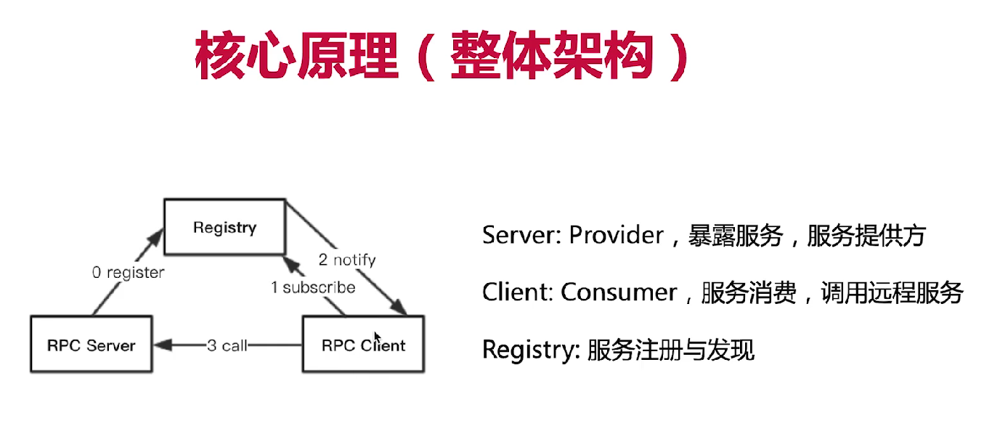

# RPC基础理论

## WHAT:

RPC: Remote Procedure Call,即远程服务调用，像调用本地方法一样调用远程的方法。 是分布式系统中最常见的通信方式。

跨进程交互的方式: RESTful、WebService、HTTP、基于DB做数据交换、基于MQ做数据交换，以及RPC

## RPC核心原理

## 现有RPC框架对比

|      |grpc     |thrift     |RMI        |dubbo      |hadoopRPC|
|----    |----     |----       |----       |----       |----|
|开发语言|多语言   |多语言     |java       |java       |java|
|序列化  |protobuf |thrift格式 |Java序列化 |hession2   |R/Writable|
|注册中心|false    |fasle      |jdk自带    |zk等       |false|
|跨语言  |true     |true       |false      |false      |false|
|服务定义|protobuf |thrift文件 |Java接口   |Java接口   |java接口|
|服务治理|false    |false      |false      |true       |false|

